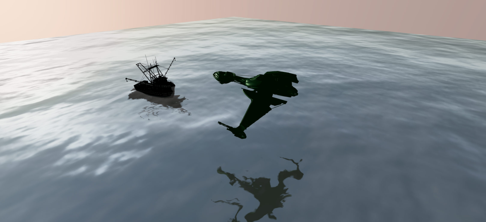

# Els Pirates Electrònics - 3D Ocean Scene



A dynamic 3D visualization featuring a solar punk pirate ship sailing toward an island, created for the upcoming event "Els Pirates Electrònics desembarquen SALA mariscal 28/08/2025". Built with Three.js, React, and Vite.

## 🌊 Scene Highlights

- **Realistic ocean** with dynamic waves and water shader effects
- **Solar punk pirate ship** with authentic detailing
- **Medas Island** 3D model in the distance
- **Dynamic sky** with realistic sun positioning
- **Ship movement system** with natural rocking motion
- **Interactive orbit controls**
- **Responsive design** that works on all devices

## 🛠️ Technologies

- Three.js (with Water and Sky extensions)
- React Three Fiber
- TypeScript
- Vite
- Minecraft font styling

## 🚢 Key Features

### Ship Animation System
- Realistic forward movement with configurable speed
- Natural rocking motion with multiple wave patterns
- Automatic slowing and stopping before camera viewpoint
- Debug display for position and speed monitoring

### Visual Effects
- Dynamic water normals and reflections
- Sun positioning matching real-world angles
- Island and ship textures with proper material properties
- Minecraft-style text overlay with fade-in effect

## 🖥️ Local Development

1. Clone the repository:
   ```bash
   git clone https://github.com/hschreier/elspirates-mariscal2015.git
   cd elspirates-mariscal2015