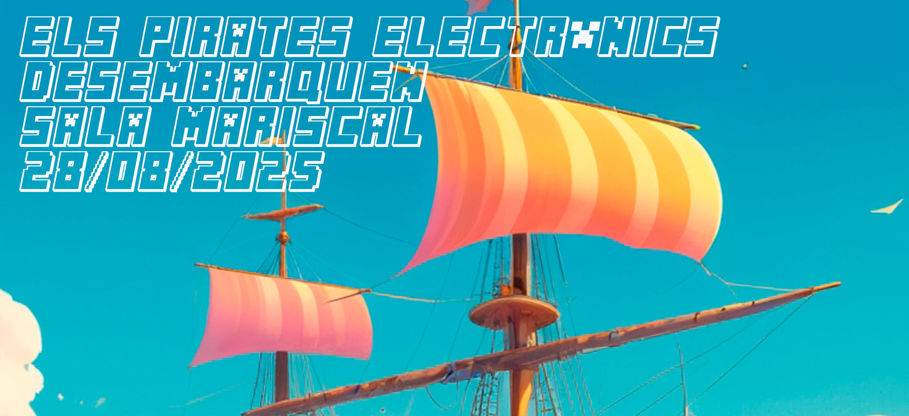

# 🌊 Els Pirates Electrònics - 3D Ocean Scene



A dynamic 3D sailing simulation featuring a solar punk pirate ship approaching Medas Island, created for the event *"Els Pirates Electrònics desembarquen SALA mariscal 28/08/2025"*.

## 🚀 Features

### 🏴‍☠️ Core Experience
- Realistic ocean with procedural waves using Three.js Water shader
- Solar punk pirate ship with authentic texture and movement physics
- Medas Island 3D model with detailed terrain
- Dynamic sky system with configurable sun position
- Minecraft-style event overlay with fade-in animation

### ⚙️ Technical Highlights
- Advanced ship movement system with:
  - Configurable speed parameters
  - Natural rocking physics (3-axis rotation)
  - Automatic deceleration and stopping
- Debug HUD showing camera/ship positions
- Responsive design supporting desktop/mobile

## 🛠 Tech Stack

| Category        | Technologies                          |
|-----------------|---------------------------------------|
| Core           | Three.js, React Three Fiber           |
| Framework      | React 18, Vite 4                      |
| Runtime        | Node 18+ **or** Bun 1.0+              |
| Styling        | CSS Modules, Minecraft font           |
| Build Tools    | TypeScript 5, ESLint, Prettier        |

## 🖥 Development

### 📦 Prerequisites
- Node.js 18+ **or** Bun 1.0+
- Git

### ⚡ Quick Start (Bun Recommended)

```bash
# Clone repository
git clone https://github.com/hschreier/elspirates-mariscal2015.git
cd elspirates-mariscal2015

# Install dependencies (Bun)
bun install

# Start development server
bun run dev

# Build for production
bun run build
```

### 🧙‍♂️ Where the Magic Happens

The core visualization lives in `components/OceanScene.tsx`, featuring:

```typescript
// CONFIGURATION PARAMETERS
const CONFIG = {
  cameraPosition: new THREE.Vector3(-13.81, 1.33, 26.67), // Starting camera
  waterSize: 100,                // Ocean plane dimensions
  shipSpeed: 0.05,               // Base movement velocity
  shipStopDistance: 15,          // Deceleration trigger distance
  shipRockingSpeed: 0.002,       // Wave animation frequency
  sunPositionSpherical: [1, 88, 180] // [intensity, azimuth, altitude]
};

// KEY SYSTEMS:
// - Water shader with normal maps
// - Ship movement physics
// - Camera tracking
// - Asset loading manager
// - Debug HUD rendering
